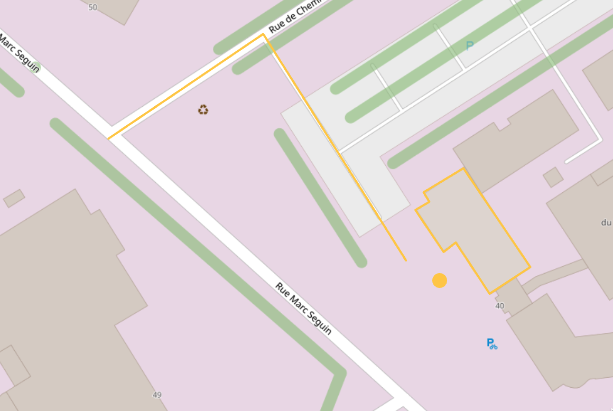

## Méthodologie de travail

<!-- La méthodologie de travail adoptée dans l'équipe de développement métier est Scrum-Agile bien que le process ressemble au développement en Cycle en V. Dans le service R&D, aucune méthodologie particulière n'est appliquée. La gestion des ticket dans tous les services est réalisée avec le framework Kanban  -->


- Cycle en V // SCRUM-Agile
- Kanban
  

---

## Architecture SIG

<!-- L'architecture SIG est composée de plusieurs mini-services divisé en deux thématiques. La partie entourée en orange est celle où je suis intervenu. GeoToolBox est le serveur de traitement et stockage des données géographiques.
GeoServeur est un serveur de partage de données cartographique. Il est consommé par GeoToolbox pour les requêtes géospatiales. Il distribue également les flux cartographiques.
MapPrint serveur est un moteur de rendu cartographique permettant de générer une carte à partir de modèles de mise en page prédéfinies.
La deuxième thématique identifiée est la recherche d'adresses dont je ne rentrerais pas dans le détail. -->


---

### Intéractions avec la carte

<!--
Nous avons décidé pour implémenter les actions sur la carte, de mettre en place le desing pattern adapter pour faciliter le passage vers une autre librairie de WebMapping si l'actuelle ne répond plus aux besoins de l'application.
Pour expliquer rapidement, nous définissons une interface `IMapService` qui est implémenté par MapService. Ce service implémente les méthodes d'openlayers. Le composant dans lequel on implémente la carte utilise le service à travers l'interface. Si nous décidons de changer de librairie cartographique, il suffira de faire une seconde implémentation pour IMapService.
-->

Pattern adapter:


---

<!--
J'ai donc écrit une fonction récursive qui permet de supprimer tous les noeuds du svg contenant la classe que j'ai blacklisté
-->

```ts
const CSS_BLACKLIST = [
  "clr-i-solid",
  "clr-i-badge",
  "clr-i-alert",
  "clr-i-solid--alerted",
  "clr-i-solid--badged",
];

const removeBlacklistedNodes = (nodeElements) => {
  nodeElements.forEach((node: Node) => {
    if (node.nodeType === Node.ELEMENT_NODE) {
      // Recursively filter nodes
      if (node.childNodes?.length > 0) {
        removeBlacklistedNodes(node.childNodes);
      }

      // Element classes
      const cssClasses =
        (node as Element).getAttribute("class")?.split(" ") ?? [];

      // Remove blacklisted node
      if (CSS_BLACKLIST.filter((bl) => cssClasses.includes(bl)).length > 0) {
        node.parentNode.removeChild(node);
      }
    }
  });
};

// Remove blacklisted nodes
removeBlacklistedNodes(svgElement.childNodes);
```
---

### Affichage des objets sur la carte

<!-- _class: lead -->



---

#### Sémiologie

<!--
Maintenant que nous avons une carte, nous pouvons afficher des objets dessus, nous devons également spécifier un style. Les objets contiennent des métadonnées en plus de la géométrie. Ils peuvent contenir des métadonnées sémiologiques qui permettent de définir en l'occurrence leur style à travers la couleur et l'icon.
-->


---

#### Récupération de l'icône

<!--
Chaque librairie ou service implémente une méthode similaire, permettant de récupérer la définition de l'icone. Le service Labels retourne directement l'image encodé en base 64. La librairie Font-awesome retourne le code SVG qui devra être encodée en base 64.
-->

`IconLibrary.getIcon(iconName: string): SVGIcon`

- Labels 😀 :

```text
data:image/{...};base64,{...}
```

- Fontawesome 😐 :

```svg
<svg xmlns="http://www.w3.org/2000/svg"><path >{...}</path></svg>
```

---

<!--
En revanche, les icones de clarity design demande plus de traitement. En effet, certains icones de la librairie possèdent des états cachés par défaut avec des couleurs spécifiques grâce au style de la page HTML. Ce style n'est pas pris en compte dans le canvas utilisé par la carte.
-->

- Clarity ☹️ :
  

```svg
<svg xmlns="http://www.w3.org/2000/svg" class="can-badge can-alert has-solid ">
  <path d="{...}" class="clr-i-outline clr-i-outline-path-1"></path>
  <path d="{...}" class="clr-i-outline clr-i-outline-path-2"></path>
  <path d="{...}" class="clr-i-outline clr-i-outline-path-3"></path>

  <path d="{...}" class="clr-i-outline--badged clr-i-outline-path-1--badged"></path>
  <path d="{...}" class="clr-i-outline--badged clr-i-outline-path-2--badged"></path>
  <path d="{...}" class="clr-i-outline--badged clr-i-outline-path-3--badged"></path>
  <path d="{...}" class="clr-i-outline--alerted clr-i-outline-path-1--alerted"></path>
  <path d="{...}" class="clr-i-outline--alerted clr-i-outline-path-2--alerted"></path>
  <path d="{...}" class="clr-i-outline--alerted clr-i-outline-path-3--alerted"></path>
  <path d="{...}" class="clr-i-outline--alerted clr-i-outline-path-4--alerted clr-i-alert"></path>
  <path d="{...}" class="clr-i-solid clr-i-solid-path-1"></path>
  <path d="{...}" class="clr-i-solid--badged clr-i-solid-path-1--badged"></path>
  <path d="{...}" class="clr-i-solid--alerted clr-i-solid-path-1--alerted"></path>
  <path d="{...}" class="clr-i-solid--alerted clr-i-solid-path-1--alerted clr-i-alert"></path>
</svg>
```

---

##### Etapes de résolution

Recherche:

❎ Implémentation existante dans la librairie
❎ Implémentation réalisé par un autre développeur
❎ Style CSS dans le canvas
✅ Suppression des noeuds avec méthodes du DOM

---