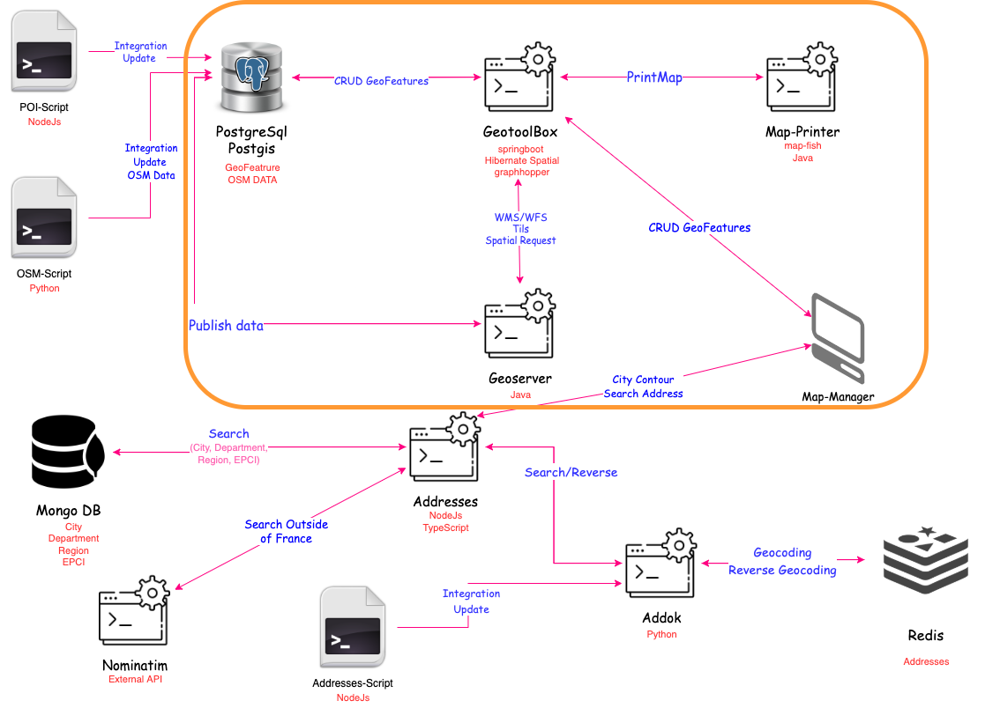

## Méthodologie de travail

<!-- La méthodologie de travail adoptée dans l'équipe de développement métier est Scrum-Agile bien que le process ressemble au développement en Cycle en V. Dans le service R&D, aucune méthodologie particulière n'est appliquée. La gestion des ticket dans tous les services est réalisée avec le framework Kanban  -->

- Cycle en V // SCRUM-Agile
- Kanban
  

---

## Architecture SIG

<!-- L'architecture SIG est composée de plusieurs mini-services divisé en deux thématiques. La partie entourée en orange est celle où je suis intervenu. GeoToolBox est le serveur de traitement et stockage des données géographiques.
GeoServeur est un serveur de partage de données cartographique. Il est consommé par GeoToolbox pour les requêtes géospatiales. Il distribue également les flux cartographiques.
MapPrint serveur est un moteur de rendu cartographique permettant de générer une carte à partir de modèles de mise en page prédéfinies.
La deuxième thématique identifiée est la recherche d'adresses dont je ne rentrerais pas dans le détail. -->

---

### Intéractions avec la carte

<!--
Nous avons décidé pour implémenter les actions sur la carte, de mettre en place le desing pattern adapter pour faciliter le passage vers une autre librairie de WebMapping si l'actuelle ne répond plus aux besoins de l'application.
Pour expliquer rapidement, nous définissons une interface `IMapService` qui est implémenté par MapService. Ce service implémente les méthodes d'openlayers. Le composant dans lequel on implémente la carte utilise le service à travers l'interface. Si nous décidons de changer de librairie cartographique, il suffira de faire une seconde implémentation pour IMapService.
-->

Pattern adapter:

---
