<style>
img[alt~="center"] {
  display: block;
  margin: 0 auto;
}
a {
  color: inherit;
  text-decoration: inherit;
}
footer {
  text-align: center;
  margin-right: 40px
}
</style>

<!-- _footer: 'RULLO Robin - Logitud Solutions - 2022' -->

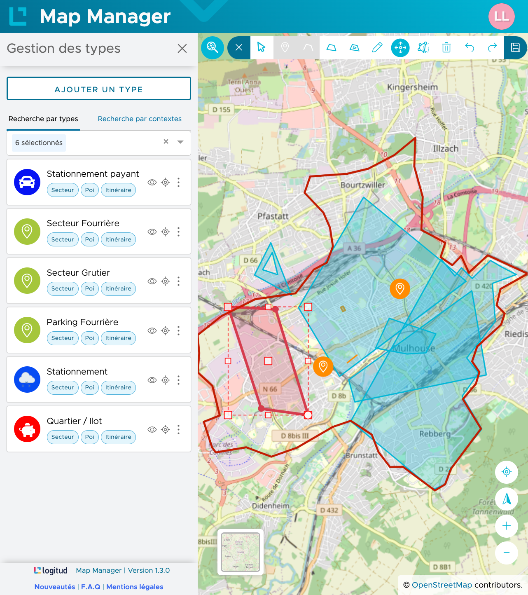

# 

Refactorisation d'une application SIG.

---

# Plan

1. [Introduction](#3)
1. [Présentation de Logitud](#4)
1. [La Géomatique](#8)
1. [Stage](#11)
1. [Conclusion](#26)

---

## Introduction


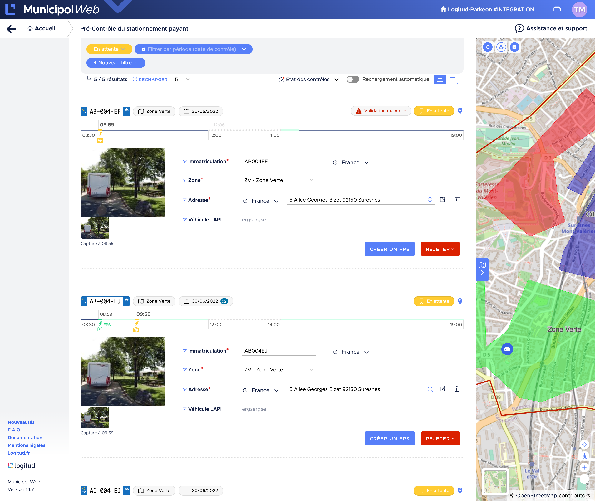

<!-- Logitud edite des logiciels depuis 1987. Depuis, les technologies ont bien changé. L'entreprise a entreprie depuis quelques années la réécriture des logiciels client lourds, devenus difficile et couteux à maintenir vers des applications web. Ces applications intéragissent et intègrent des données géospatiales comme l'application MW (Montrer la capture d'écran). C'est le rôle de Map-Manager d'administrer la données cette données. Des demandes d'évolutions sur la structure et l'ergonomie a nécéssité la réécriture complète de l'application. J'ai souhaité, grâce ce stage, gagner en compétence dans le domaine de la géomatique que nous survolerons rapdiement un peu plus tard, ainsi que dans le développement front-end avec le framework Angular -->

- Application Web "clients légers"
- Applications avec données géospatiales
- Expérience en géomatique

---

# Logitud Solutions

<!-- Le siège social de Logitud est basé au Parc des Collines de Mulhouse. La société compte deux autres agences où sont employés des formateurs et des commerciaux. L'activité a lieu principalement à l'agence de Mulhouse. -->

<!-- _class: lead -->

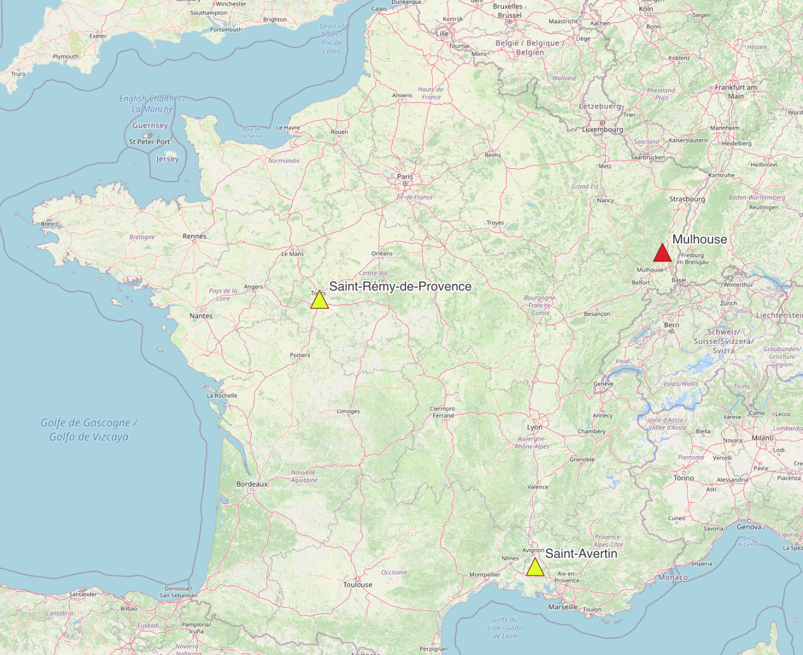

---

## Besoin métier

<!-- Elle distribue trois gamme de logiciels:
- La gamme population qui est tournée vers la gestion administrative des collectivités. Elle facilite le travail des agents d'état civil et leurs echanges avec les administrés.
- La gamme sécurité qui est orientée vers la gestion des métiers de la police municipale
- Enfin la gamme e-administration qui regroupe des services en ligne et mobiles à l'attention des citoyens et qui sont interconnectés avec la gamme population.
-->


- population
- sécurité
- e-administration

---

## Chiffres clefs

<!-- L'entreprise compte 86 collaborateurs dont 24 sont développeurs. Egalement 2 collaborateurs de PIX'ELLE (récemment racheté). 74 sur le site de Mulhouse) -->

- 86 Employés (24 Développeurs)
- Gamme population: 1/3 des villes (> 5 000 habitants)
- Gamme sécurité: 4/5 des villes (> 5 000 habitants)

---

## Méthodologie de travail

<!-- La méthodologie de travail adoptée dans l'équipe de développement métier est Scrum-Agile bien que le process ressemble au développement en Cycle en V. Dans le service R&D, aucune méthodologie particulière n'est appliquée. La gestion des ticket dans tous les services est réalisée avec le framework Kanban  -->

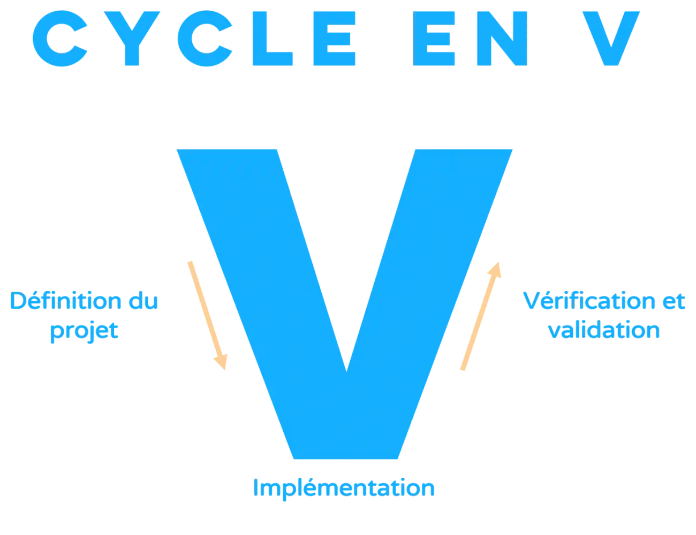

- Cycle en V // SCRUM-Agile
- Kanban
  

---

# Géomatique

<!--
La géomatique regroupe les pratiques, les méthodes et les technologies permettant decollecter, analyer et diffuser les données géographiques. L'objectif final est de les représenter, c'est le besoin auquel répond map-manager.
-->


---

## Projection

<!--
Afin de représenter les données géographiques, il est nécessaire de définir un référentiel et une projection pour les données. La projection permet de représenter la surface de la Terre sur la surface plane d'une carte. Le référentiel permet de définir les coordonnées (latitude, longitude) de chaque point sur la carte.
-->

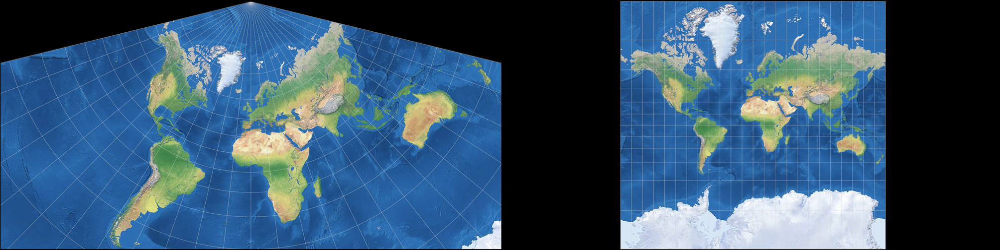
Lambert Conique Conforme                  World Geodetic System WGS 84

---

## Géométries

<!-- En géomatique, on distingue 3 types de géométries:
- Le point
- La ligne
- Le polygone
Il est possible de créer des multi-géométrie, une géométrie qui contient une collection de géométries du même type.
 -->

- Point
  <br/>
- Ligne (LineString)
  <br/>
  <br/>
- Polygone (Polygon)

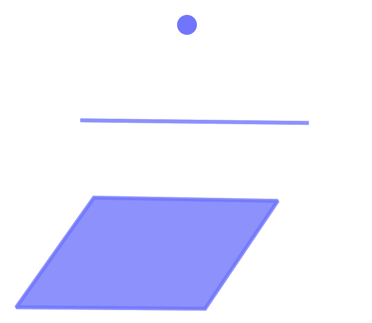

---

# Le stage

_Refactorisation d'une application SIG._

<!-- Présentation du plan -->
<!-- _class: lead -->

1.  [Documentation de l'existant et prototypage](#13)
1.  [Intégration de la maquette](#13)
1.  [Démonstration](https://applications-dev.logitud.fr/logitud-test/map-manager/)
1.  [Évolutions et perspectives](#25)

---

## Architecture SIG

<!-- L'architecture SIG est composée de plusieurs mini-services divisé en deux thématiques. La partie entourée en orange est celle où je suis intervenu. GeoToolBox est le serveur de traitement et stockage des données géographiques.
GeoServeur est un serveur de partage de données cartographique. Il est consommé par GeoToolbox pour les requêtes géospatiales. Il distribue également les flux cartographiques.
MapPrint serveur est un moteur de rendu cartographique permettant de générer une carte à partir de modèles de mise en page prédéfinies.
La deuxième thématique identifiée est la recherche d'adresses dont je ne rentrerais pas dans le détail. -->

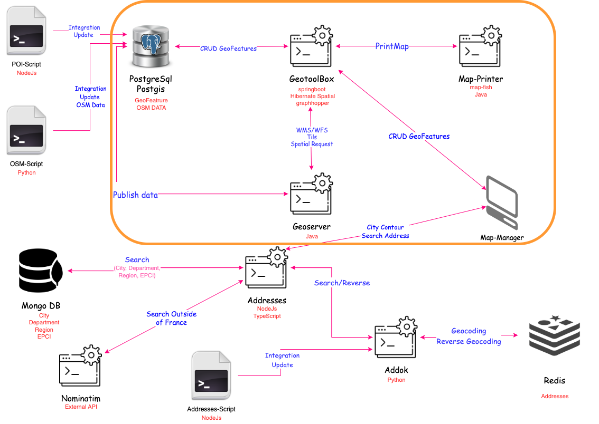

---

## Existant


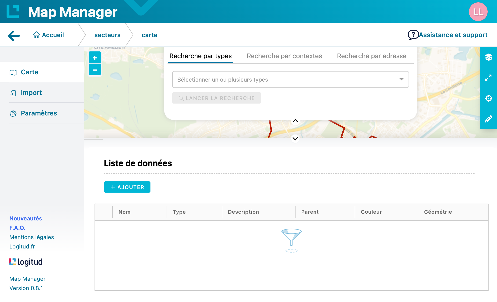

---

### Documentation

<!-- L'application Map-Manager étant déjà existante, je l'ai découverte et j'ai réalisé une documentation reprenant toutes les fonctionnalités. Pour documenter les fonctionnalités, j'ai suivi les principes du manual testing en testant une par une les fonctionnalité à la main. J'ai ensuite rédigé un document rendant compte des différentes fonctionnalités développés afin de posséder un point de départ pour la nouvelle version. -->

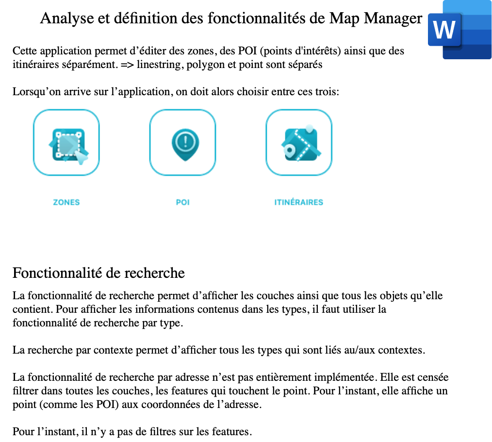

---

## Besoins

- Isofonctionnalité
- Ergonomie
- Carto-centré, page unique
- Géométries regroupées

---

## Prototypage

<!--
J'ai débuté par le prototypage de la nouvelle interface utilisateur sur le logiciel Adobe XD. Je me suis inspiré pour la première version de la maquette de l'application mapillary. J'ai ensuite retravaillé la présentation pour conserver une cohérence avec les autres applications de la suite logicielle. Nous avons ensuite validé la maquette avec les représentants du service client afin de s'assurer de répondre aux nouveaux besoins.
-->

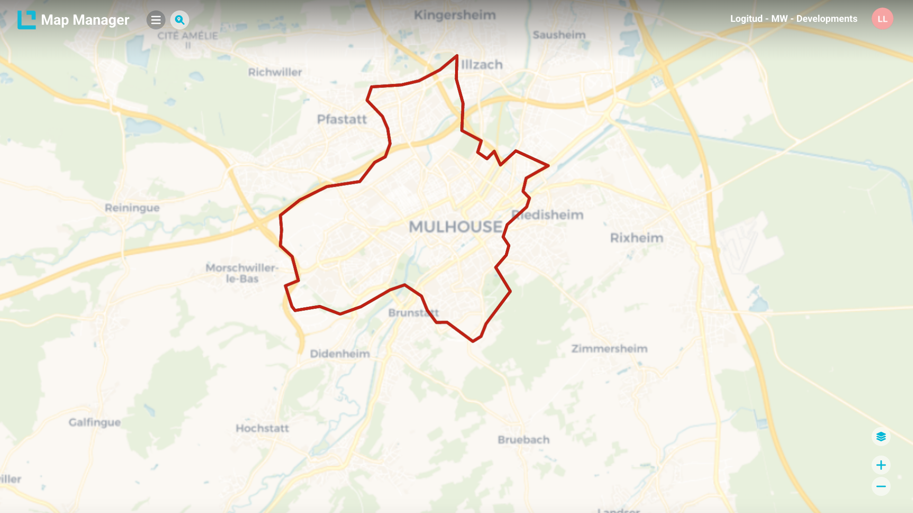
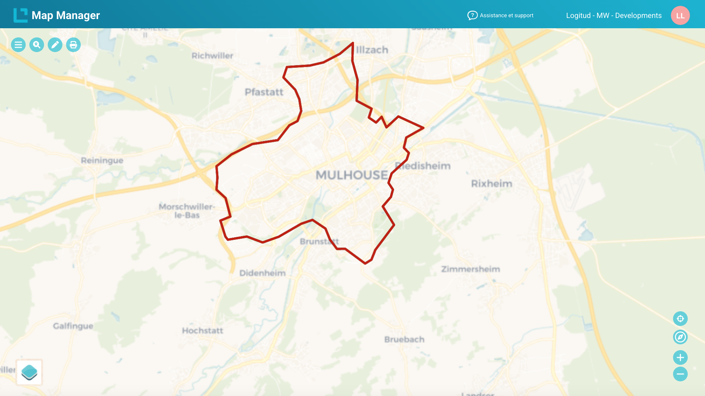

---

## Intégration de la maquette

<!--
J'ai ensuite débuté l'implémentation de la maquette dans l'application Angular
-->


---

### Interaction avec les services externes

<!--
 En plus des serveurs carto-spécifiques que je vous ai déjà présenté losrque j'ai parlé de l'architecture de l'architecture SIG de l'entreprise, l'application intéragis avec plusieurs services génériques externes. Tout d'abord, le repository afin de récupérer les informations de l'utilisateur connecté. Il intéragis également avec le serveur labels afin de récupérer les contextes de l'application métier.
-->

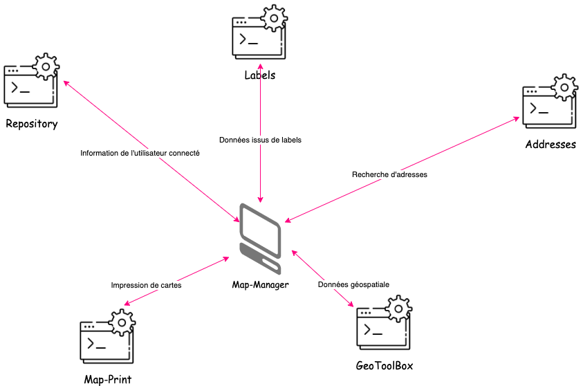

---

<!-- ### Intéractions avec la carte

<!--
Nous avons décidé pour implémenter les actions sur la carte, de mettre en place le desing pattern adapter pour faciliter le passage vers une autre librairie de WebMapping si l'actuelle ne répond plus aux besoins de l'application.
Pour expliquer rapidement, nous définissons une interface `IMapService` qui est implémenté par MapService. Ce service implémente les méthodes d'openlayers. Le composant dans lequel on implémente la carte utilise le service à travers l'interface. Si nous décidons de changer de librairie cartographique, il suffira de faire une seconde implémentation pour IMapService.
->

Pattern adapter:


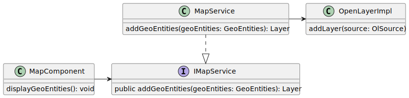

---
-->

#### Sémiologie

<!--
Maintenant que nous avons une carte, nous pouvons afficher des objets dessus, nous devons également spécifier un style. Les objets contiennent des métadonnées en plus de la géométrie. Ils peuvent contenir des métadonnées sémiologiques qui permettent de définir en l'occurence leur style à travers la couleur et l'icon.
 -->

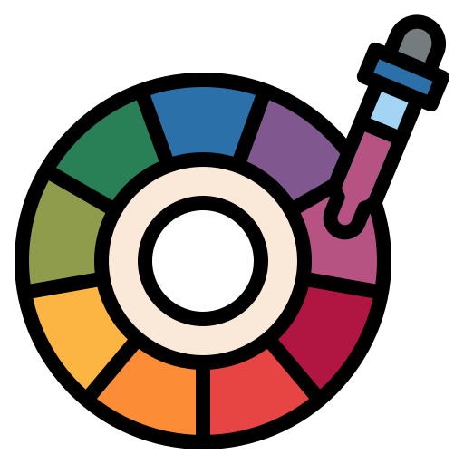


---

#### Récupération de l'icône

<!-- Chaque librairie ou service implémente une méthode similaire, permettant de récupérer la définition de l'icone. Le service Labels retourne directement l'image encodé en base 64. La librairie Font-awesome retourne le code SVG qui devra être encodée en base 64. -->

`IconLibrary.getIcon(iconName: string): SVGIcon`

- Labels 😀 :

```text
data:image/{...};base64,{...}
```

- Fontawesome 😐 :

```svg
<svg xmlns="http://www.w3.org/2000/svg"><path >{...}</path></svg>
```

---

<!--
En revenche, les icones de clarity design demande plus de traitement. En effet, certains icones de la librairie possèdent des états cachés par défaut avec des couleurs spécifiques grâce au style de la page HTML. Ce style n'est pas pris en compte dans le canvas utilisé par la carte.
-->

- Clarity ☹️ :
  

```svg
<svg xmlns="http://www.w3.org/2000/svg" class="can-badge can-alert has-solid ">
  <path d="{...}" class="clr-i-outline clr-i-outline-path-1"></path>
  <path d="{...}" class="clr-i-outline clr-i-outline-path-2"></path>
  <path d="{...}" class="clr-i-outline clr-i-outline-path-3"></path>

  <path d="{...}" class="clr-i-outline--badged clr-i-outline-path-1--badged"></path>
  <path d="{...}" class="clr-i-outline--badged clr-i-outline-path-2--badged"></path>
  <path d="{...}" class="clr-i-outline--badged clr-i-outline-path-3--badged"></path>
  <path d="{...}" class="clr-i-outline--alerted clr-i-outline-path-1--alerted"></path>
  <path d="{...}" class="clr-i-outline--alerted clr-i-outline-path-2--alerted"></path>
  <path d="{...}" class="clr-i-outline--alerted clr-i-outline-path-3--alerted"></path>
  <path d="{...}" class="clr-i-outline--alerted clr-i-outline-path-4--alerted clr-i-alert"></path>
  <path d="{...}" class="clr-i-solid clr-i-solid-path-1"></path>
  <path d="{...}" class="clr-i-solid--badged clr-i-solid-path-1--badged"></path>
  <path d="{...}" class="clr-i-solid--alerted clr-i-solid-path-1--alerted"></path>
  <path d="{...}" class="clr-i-solid--alerted clr-i-solid-path-1--alerted clr-i-alert"></path>
</svg>
```

---

<!--
J'ai donc écrit une fonction récursive qui permet de supprimer tous les noeuds du svg contenant la classe que j'ai blacklisté
-->

```ts
const CSS_BLACKLIST = [
  "clr-i-solid",
  "clr-i-badge",
  "clr-i-alert",
  "clr-i-solid--alerted",
  "clr-i-solid--badged",
];

const removeBlacklistedNodes = (nodeElements) => {
  nodeElements.forEach((node: Node) => {
    if (node.nodeType === Node.ELEMENT_NODE) {
      // Recursively filter nodes
      if (node.childNodes?.length > 0) {
        removeBlacklistedNodes(node.childNodes);
      }

      // Element classes
      const cssClasses =
        (node as Element).getAttribute("class")?.split(" ") ?? [];

      // Remove blacklisted node
      if (CSS_BLACKLIST.filter((bl) => cssClasses.includes(bl)).length > 0) {
        node.parentNode.removeChild(node);
      }
    }
  });
};

// Remove blacklisted nodes
removeBlacklistedNodes(svgElement.childNodes);
```

---

### Documentation des modifications et livraisons

<!-- Avant de mettre en production la novuelle version de Map Manager, on m'a demandé de générer un changelog. Depuis le début du développement je me suis donné comme contrainte de suivre la convention de commit d'Angular; Présenter la convention -->

- Convention:
  `feat|fix|docs|style|refactor|perf|test|chore(scope?): add...`

- Exemple
  `fix(edit-geolayer): data initialized with geolayer on cancel`

---

<!--
Cela m'a permi de générer automatiquement le changelog et de suivre la convention SemVer. Le générateur de changelog détecte et bump le numéro de version en fonction du type.
-->

- Changelog version 1.2.0

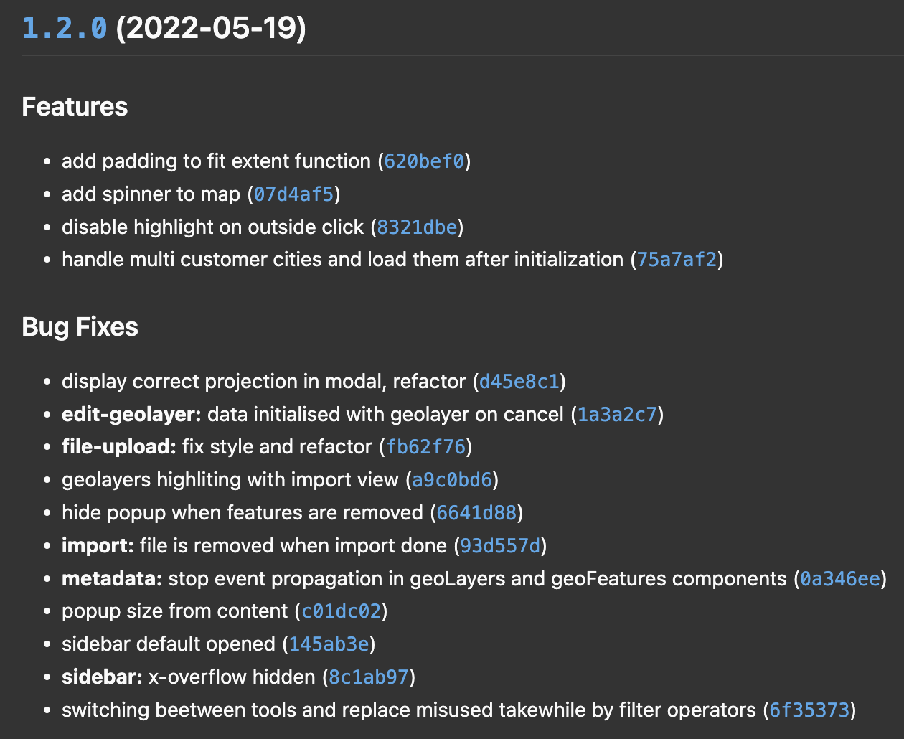

---

# Améliorations et perspectives

<!--
Bien que l'application soit plus riche en fonctionnalités que la version précédante, plusieurs améliorations sont envisavées.
-->

- Personnalisation utilisateur
- Impression
- Viewer Mapillary
- Nouvelles demandes des clients

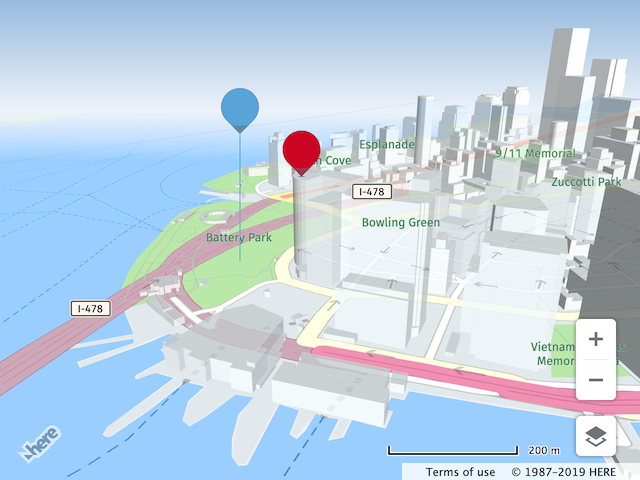
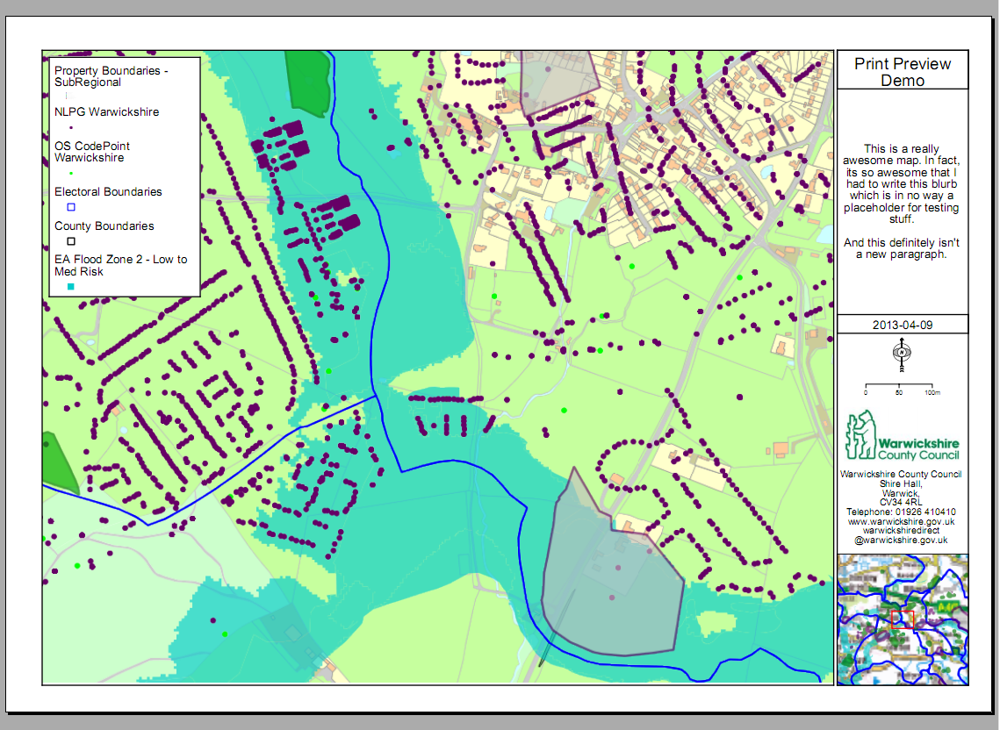
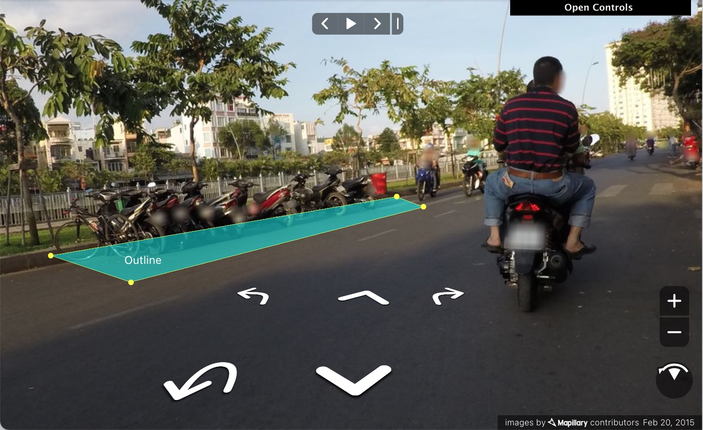

---

# Conclusion

<!--
Pour conclure, la nouvelle version de l'application réponds aux attentes et besoins que l'on m'a fixé. L'interface est ergonomique et l'application est fonctionnelle.
J'ai réussi à trouver une solutions pour les différents problèmes rencontrés comme l'absence de documentation ou contraintes liés à l'entreprise.
 De plus, j'ai terminé la refonte rapidement, ce qui m'a permi de participer à d'autres projets.
-->

Répond aux besoins:
✅ Ergonomique,
✅ Iso-fonctionnel et ➕
✅ En production
✅ Difficultés surmontées

⮕ Problématique résolue

---

<!--
- PROCESS: En termes de process, concernant une solution solutionnelle, il faut décloisonner les capitaux qualité
- MANAGEMENT: Pour externaliser une dynamique managériale, on doit anticiper les sourcing investissement.
- PIPO: Malgré l'opportunité multi-directionnelle, il faut optimiser les recapitalisations compétitivité.
- PIPO: Partout où domine la stagflation ambitionnelle, un meilleur relationnel permet d'imaginer les thématiques métier.
- En auditant la prestation accélérationnelle, les décisionnaires veulent déployer les montées en régime des bénéfices.
-->

<!-- _class: lead -->

# Questions
