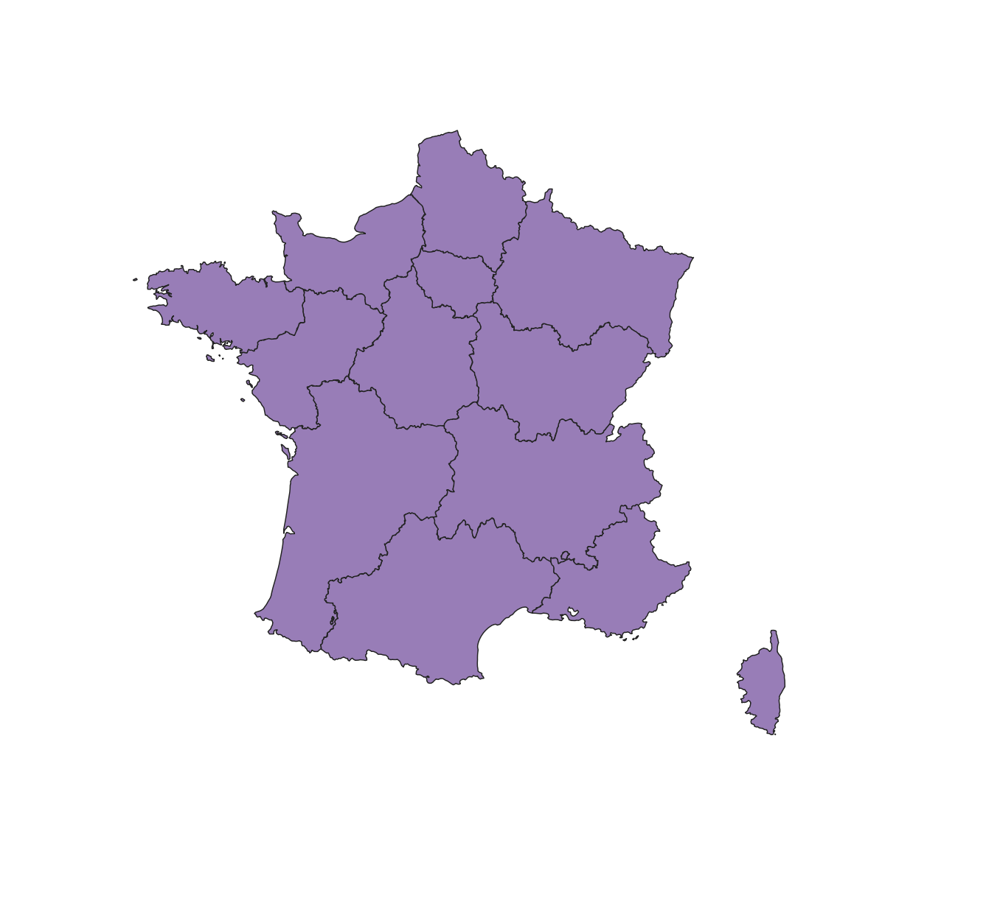
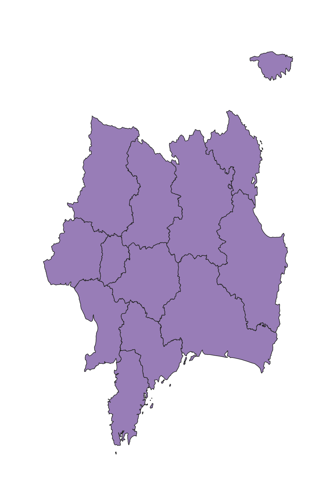
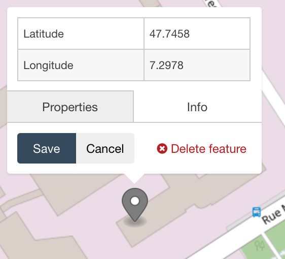
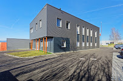
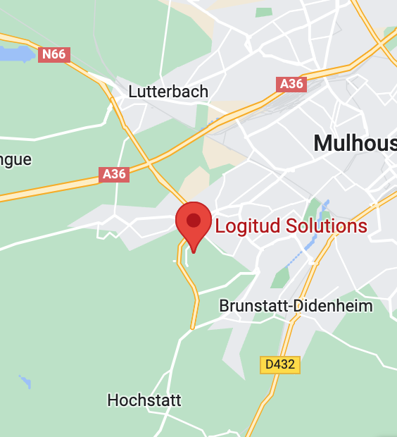
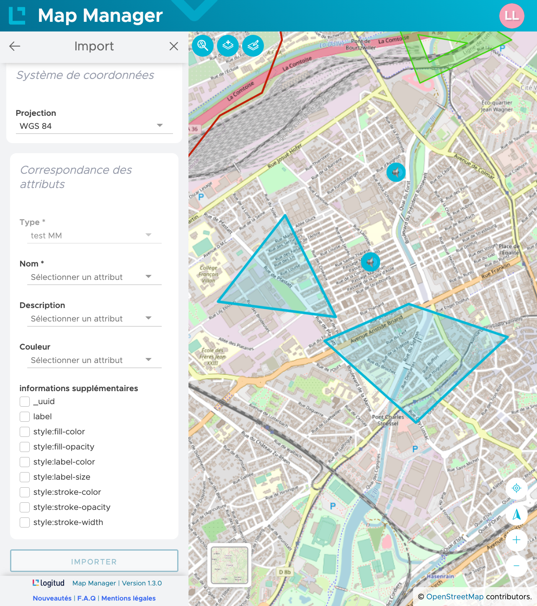

# 


Refactorisation d'une application SIG.

---
# Géomatique


---
## Projection


<br><br><br><br><br><br><br><br>EPSG:2154 - Lambert 93                           EPSG:6363 - Mexico ITRF2008



---
## Coordonnées

 

---
# Logitud Solutions




---
## Domaines d'application


---
## Chiffres clefs

- XX Employés (XX Développeurs)
- XX Clients

---
# Import de géométries


- GeoJSON
- KML
- Shapefile

---
## Format de données
```json
{ // GeoJSON
  "type": "FeatureCollection",
  "features": [
    {
      "type": "Feature",
      "properties": {},
      "geometry": {
        "type": "Point",
        "coordinates": [
          7.2977596521377555,
          47.745773344324796
        ]
      }
    }
  ]
}
```

---
# Améliorations et perspectives

- Personnalisation utilisateur
- Impression
- Viewer Mapillary
- Nouvelles demandes des clients


---
# Conclusion

- [x] Réponse aux besoins
- [x] Ergonomique et fonctionnel
- [x] Rapidité de développement

⮕ Mission remplie
