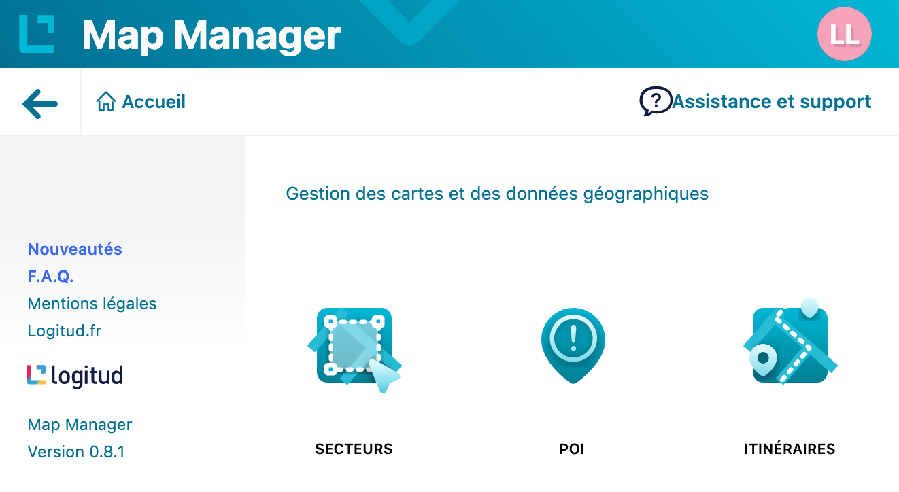

<!-- !!! Transitions,  -->

<!--
Bonjour.
Je m'appelle Robin RULLO. Je suis étudiant en 2ème année à l'UHA 4.0. Je vais vous présent le stage que j'ai effectué de mi-février à mi-aout à Logitud Solutions. Mon tuteur de stage académique est M. Elbaz et en entreprise M. Sahi ci-présent.
Mon sujet traite de la refonte d'une application de type SIG pour système d'information géographique.
-->

<!-- _footer: 'RULLO Robin - 2022' -->

### Soutenance de stage

_Réécriture et amélioration d'une application SIG_

 

---

# Plan

1. [Introduction](#3)
1. [Présentation de Logitud](#4)
1. [La Géomatique](#8)
1. [Stage](#11)
1. [Conclusion](#23)

---

## Introduction

<!--
1,5 minutes

Logitud édite des logiciels depuis 30 ans. En 30 ans les technologies ont bien changé. L'entreprise a entrepris depuis quelques années la réécriture des logiciels client lourds, devenus difficile et couteux à maintenir vers des applications web.

Les nouvelles applications contrairement aux anciennes intègrent un lot important d'informations cartographiques.
-->

- Application Web "clients légers"
- Applications avec données géospatiales

---

# Logitud Solutions

<!--
2 minutes

Le siège social de Logitud est basé au Parc des Collines de Mulhouse. La société compte deux autres agences où sont employés des formateurs et des commerciaux. L'activité a lieu principalement à l'agence de Mulhouse.
-->

<!-- _class: lead -->

---

## Métiers concernés

<!--
5 minutes

Elle distribue trois gamme de logiciels :
- La gamme population qui est tournée vers la gestion administrative des collectivités. Elle facilite le travail des agents d'état civil et leurs échanges avec les administrés.
- La gamme sécurité qui est orientée vers la gestion des métiers de la police municipale
- Enfin la gamme e-administration qui regroupe des services en ligne et mobiles à l'attention des citoyens et qui sont interconnectés avec la gamme population.
-->

- population
- sécurité
- e-administration

---

## Chiffres clefs

<!--
Pour les quelques chiffres clefs, l'entreprise compte 86 collaborateurs, 74 basés à Mulhouse. 24 d'entre-eux sont développeurs et 4, chefs de projets.

J'ai souhaité en déposant ma candidature chez Logitud, gagner en compétence dans le domaine de la géomatique, ainsi que dans le développement front-end avec le framework Angular
-->

- 86 Collaborateurs (24 Développeurs)
- Gamme population: 1/3 des villes (> 5 000 habitants)
- Gamme sécurité: 4/5 des villes (> 5 000 habitants)

---

# Géomatique

<!--
6 minutes

La géomatique regroupe les pratiques, les méthodes et les technologies permettant de collecter (Photogramétrie, topographie et télédection spatial), analyser et diffuser les données géographiques. L'objectif final étant de les représenter, c'est le besoin auquel répond map-manager.

Objectif final Comité de pilotage de prendre une décision
-->

---

## Géométries

<!--
8 minutes

En géomatique, sur les collections d'objets vectoriels comme par exemple le format GeoJSON dont un exemple est joint en annexe 1 du rapport, on distingue 3 types de géométries :
- Le point
- La ligne
- Le polygone
Il est possible de créer des multi-géométrie, une géométrie qui contient une collection de géométries du même type.
-->

- Point
   
- Ligne (LineString)
   
   
- Polygone (Polygon)

---

## Projection

<!--
Afin de représenter les données géographiques, il est nécessaire de définir un référentiel qui permet de définir les coordonnées (latitude, longitude) de chaque point sur la carte ainsi qu'une projection pour les données. Celle-ci permet de représenter le globe sur une surface plane.
-->

Lambert Conique Conforme                  World Geodetic System WGS 84

---

# Le stage

<!-- 8 minutes -->

_Réécriture et amélioration d'une application SIG_

<!-- Présentation du plan -->
<!-- _class: lead -->

1. [Présentation des besoins]()
1. [Présentation de l'application]()
1. [Documentation de l'existant]()
1. [Prototypage]()
1. [Intégration de la maquette]()
1. [Documentation des modifications]()
1. [Évolutions et perspectives]()
<!-- 1.  [Démonstration](https://applications-dev.logitud.fr/logitud-test/map-manager/) -->

---

## Besoins

<!--
8,5 minutes

L'application devra être dans un premier temps au minimum iso-fonctionnelle. On devra tenir compte de l'ergonomie pour l'utilisateur en gardant la carte toujours visible et dégagée. L'application doit être à page unique en regroupant les différents types d'objets géographiques.

La pm veut poser la position de la caméra avec la zone de couverture du caméras. Les diférentes geom était interfacés à part.
-->

- Isofonctionnalité
- Ergonomie
- Carto-centré, page unique
- Géométries regroupées

---

<!-- _class: lead -->

## Map-Manager

<!-- L'application Map-Manager est l'application qui permet de centraliser la gestions des objets géographiques des logiciels (ex cartographie des cimetières dans webcimetière, MW, etc...) dans une seule application.
-->

---

## Fonctionnalités

- Recherche d'adresses

---

## Fonctionnalités

- Affichage de collections d'objets géographiques

---

## Fonctionnalités

- Affichage du contenu des collections

---

## Fonctionnalités

- Ajout d'objets géographiques

---

## Fonctionnalités

- Dessin / Modification d'objets géographiques
  <!-- Transition: Cette fonctionnalité est surtout dédié aux petites et moyennes communes qui n'ont pas de ressources cartographiques pré-existantes  -->
  

---

## Fonctionnalités

- Import d'objets géographiques

<!-- Pour les plus grandes communes, elles pourront importer leurs ressources dans différents formats tel que le GeoJSON dont vous avez un exemple en annexe 1 de mon rapport, ou encore KML et shapefile.

Possibiliter de choisir la projection appropriée à la source de données.
-->

---

## Map-Viewer

- Librairie Angular Commune

<!--
Nous avons également une librairie commune qui s'appelle Map-Viewer qui est implémenté dans les différentes application permmettant d'afficher les objets géographiques administré par Map-Manager.
-->

---

### Architecture SIG de Logitud

<!--
11 minutes

Map-Manager est une Application Web Angular 9. Nous avons été contraints à ce choix par l'écosystème existant de Logitud.

Map Manager intéragis avec les différents services cartographiques de l'entreprise. Elle récupère les géométries sur le serveur GeoToolbox. Ce serveur utilisant le framework Springboot permet de réaliser les traitements nécéssaires aux données géographique. Il permet notamment de gérer les buffers, les intersections de géométries, les calculs de distance.
Le deuxième service avec lequel intéragis Map-Manager est le service de recherche d'adresse. Il est basé sur le moteur de recherche Addok, maintenu par Etalab (organisme de l'état). Il permet d'intégrer les données de la BAN (Base d'Adresses Nationale).
Le dernier service cartographique avec lequel intéragis Map-Manager est le service d'impression de la carte. Il est basé sur MapFish qui est un moteur de rendu cartographique. MapFish se base sur un modèle provenant de l'outil Jaspersoft qui est également la librairie de rendu de documents la plus mature de l'écosystème Java.
-->

<!-- Revoir les titres des services -->

---

## Existant

<!--
14

L'application à mon arrivée, était déjà existante. Cependant, de nouveaux besoins ont nécessité une modification de l'agencement des fonctionnalités
-->

---

### Documentation

<!--
14,5 minutes

J'ai suivi les principes du manual testing pour tester et découvrir les fonctionnalités. J'ai ensuite rédigé un document rendant compte des différentes fonctionnalités développés, joint en annexe 2 du rapport, afin de posséder un point de départ pour la nouvelle version.
-->

---

## Prototypage

<!--
15 minutes

J'ai débuté par le prototypage de la nouvelle interface utilisateur sur le logiciel Adobe XD. Je me suis inspiré pour la première version de la maquette de l'application mapillary. J'ai ensuite retravaillé la présentation pour conserver une cohérence avec les autres applications de la suite logicielle. Nous avons ensuite validé la maquette avec les représentants du service client afin de s'assurer de répondre aux nouveaux besoins.
-->

---

## Intégration de la maquette

<!--
16 minutes

J'ai ensuite débuté l'implémentation de la maquette dans l'application Angular
-->

---

### Documentation des modifications du code source

<!--
17 minutes

Avant de mettre en production la nouvelle version de Map Manager, on m'a demandé de générer un changelog. Depuis le début du développement je me suis donné comme contrainte de suivre la convention de commit d'Angular; Présenter la convention
-->

- Convention:
  `feat|fix|docs|style|refactor|perf|test|chore(scope?): add...`

- Exemple
  `fix(edit-geolayer): data initialized with geolayer on cancel`

---

<!--
Cela m'a permis de générer automatiquement le changelog et de suivre la convention SemVer. Le générateur de changelog détecte et bump le numéro de version en fonction du type.
-->

- Changelog version 1.2.0

---

## Evolutions futures

<!--
18 minutes

Bien que l'application soit plus riche en fonctionnalités que la version précédente, plusieurs améliorations sont envisagées.
-->

- Préférences utilisateur
- Impression de la carte
- Dessin sur image
- Nouvelles demandes des clients

---

# Conclusion

<!--
19 minutes

Pour conclure, la nouvelle version de l'application réponds aux attentes et besoins que l'on m'a fixés. L'interface est ergonomique et l'application est fonctionnelle.
J'ai réussi à trouver une solution pour chaque problèmes que j'ai rencontrés comme l'absence de documentation ou contraintes liés à l'entreprise.
De plus, j'ai terminé la refonte rapidement, ce qui m'a permis de participer à d'autres projets.
-->

Répond aux besoins:
✅ Ergonomique,
✅ Iso-fonctionnel et ➕
✅ En production
✅ Difficultés surmontées

⮕ Problématique résolue

---

<!--
- PROCESS: En termes de process, concernant une solution solutionnelle, il faut décloisonner les capitaux qualité
- MANAGEMENT: Pour externaliser une dynamique managériale, on doit anticiper les sourcing investissement.
- PIPO: Malgré l'opportunité multi-directionnelle, il faut optimiser les recapitalisations compétitivité.
- PIPO: Partout où domine la stagflation ambitionnelle, un meilleur relationnel permet d'imaginer les thématiques métier.
- En auditant la prestation accélérationnelle, les décisionnaires veulent déployer les montées en régime des bénéfices.
-->

<!-- _class: lead -->

# Questions
